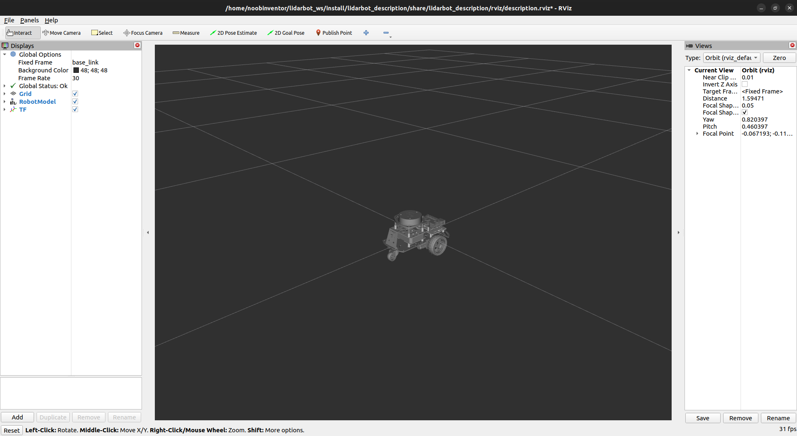

# Lidarbot


A differential drive robot is controlled using ROS2 Humble running on a Raspberry Pi 4 (running Ubuntu server 22.04). The vehicle is equipped with a raspberry pi camera for visual feedback and an RPLIDAR A1 sensor used for Simultaneous Localization and Mapping (SLAM), autonomous navigation and obstacle avoidance. Additionally, an MPU6050 inertial measurement unit (IMU) is employed by the robot localization package on the robot, to fuse IMU sensor data and the wheel encoders data, using an extended kalman filter (EKF) node, to provide more accurate robot odometry estimates.

Hardware interfaces are written for the Waveshare motor driver HAT and MPU6050 sensor to be accessed by the `ros2_control` differential drive controller and Imu sensor broadcaster respectively, via the `ros2_control` resource manager.

***(Work in Progress)***

## Package Overview
- [`lidarbot_base`](./lidarbot_base/) : Contains the ROS2 control hardware interface for the lidarbot with low-level code for the Waveshare Motor Driver HAT.
- [`lidarbot_bringup`](./lidarbot_bringup/) : Contains launch files to bring up the camera, lidar and the real lidarbot.
- [`lidarbot_description`](./lidarbot_description/) : Contains the URDF description files for lidarbot, sensors and `ros2 control`.
- [`lidarbot_gazebo`](./lidarbot_gazebo/) : Contains configuration, launch and world files needed to simulate lidarbot in Gazebo.
- [`lidarbot_navigation`](./lidarbot_navigation/) : Contains launch, configuration and map files used for lidarbot navigation.
- [`lidarbot_slam`](./lidarbot_slam/) : Contains configuration files for the slam toolbox and RViz, launch file to generate maps using SLAM.
- [`lidarbot_teleop`](./lidarbot_teleop/) : Contains configuration and launch files used to enable joystick control of the lidarbot in simulation and physically.

## Hardware
### Part list
The following components were used in this project:

| | Part |
| --| --|
|1| [Raspberry Pi 4 (4 GB)](https://www.raspberrypi.com/products/raspberry-pi-4-model-b/)|
|2| SanDisk 32 GB SD Card|
|3| [Two wheel drive robot chassis kit (with wheel encoders)](https://www.amazon.com/perseids-Chassis-Encoder-Wheels-Battery/dp/B07DNYQ3PX/ref=sr_1_9?crid=3T8FVRRMPFCIX&keywords=two+wheeled+drive+robot+chassis&qid=1674141374&sprefix=two+wheeled+drive+robot+chas%2Caps%2C397&sr=8-9)|
|4| [Waveshare Motor Driver HAT](https://www.waveshare.com/wiki/Motor_Driver_HAT)|
|5| [2 x Photo interrupters for wheel encoders](https://www.aliexpress.com/item/32773600460.html?spm=a2g0o.order_list.order_list_main.5.21ef1802uhtGk4)|
|6| MPU6050 board|
|7| [RPLIDAR A1](https://www.slamtec.com/en/Lidar/A1)|
|8| Raspberry Pi camera v1.3|
|9| [3D printed stands for RPLIDAR A1 and RPi 4](https://www.thingiverse.com/thing:3970110)|
|10| Mount for Raspberry Pi camera|
|11| Powerbank for RPi 4 (minimum output: 5V 3A)|
|12| 3 Slot 18650 battery holder|
|13| 3 x 18650 batteries to power Motor Driver HAT|
|14| Female to Female Dupont jumper cables|
|15| Spare wires|
|16| On/Off switch (included in robot chassis kit)|

Some other tools or parts used in the project are as follows:

| | Tool/Part |
| --| --|
|1| Soldering iron|
|2| 3D printer|
|3| Screwdriver set|
|4| Double-sided tape|

### Project Wiring and Assembly

The electronic components of the lidarbot are connected as shown below.

<p align="center">
  
</p>

The MPU6050 board pins were connected to the Raspberry Pi 4 GPIO pins as follows:

| MPU6050 board | GPIO.BOARD| GPIO.BCM|
| ----------- | ------------| ------ |
| VCC         | 3.3V | 3.3V |
| GND         | GND | GND |
| SCL         | 05 | GPIO03 |
| SDA         | 03 | GPIO02 |

The right and left photo interrupter sensors are connected to GPIO pins as follows:

| Photo interrupter (R) | GPIO.BOARD | GPIO.BCM|
| ----------- | ------------| ------ |
| OUT | 18 | GPIO24 |
| VCC | 5V | 5V |
| GND | GND | GND |

| Photo interrupter (L) | GPIO.BOARD | GPIO.BCM|
| ----------- | ------------| ------ |
| OUT | 22 | GPIO25 |
| VCC | 5V | 5V |
| GND | GND | GND |

<p align="center">
  
  
</p>

The screw terminal blocks on the Motor Driver HAT ([shown below](https://www.waveshare.com/wiki/Motor_Driver_HAT)) are connected to the motor wires and battery holder cables as follows: 

| Motor Driver HAT pin | Connected to| 
| -- | -- |
| MA1 | Red wire (Left motor)| 
| MA2 | Black wire (Left motor)| 
| GND | Black wire (battery holder) | 
| VIN | Red wire (battery holder) | 
| MB1 | Red wire(Right motor)| 
| MB2 | Black wire (Right motor)| 

<p align="center">
  
</p>

Solder the cables (provided) to the motors. Might need to use spare wires if the provided ones are too short to reach the motor hat. Should the wheel(s) move in the direction opposite of what is expected, exchange the respective motor cables screwed into the terminal blocks.


Finally, the Raspberry Pi camera is connected to the ribbon slot on the Raspberry Pi 4 and the RPLIDAR A1 sensor is plugged into one of the Pi 4's USB ports.

<p align='center'>
  
</p>

<p align="center">
  
</p>

## Installation

| Gazebo | RViz |
| :------: | :----: |
| |  |

## SLAM

### Gazebo

To start mapping in a simulation environment, launch the Gazebo simulation of lidarbot which includes the joystick node for teleoperation:

```
ros2 launch lidarbot_gazebo gazebo_launch.py
```

In a separate terminal, navigate to the workspace directory, `lidarbot_ws` for example, and launch `slam_toolbox`:

```
ros2 launch slam_toolbox online_async_launch.py slam_params_file:=/src/lidarbot_slam/config/mapper_params_online_async.yaml use_sim_time:=true
```

In another terminal, navigate to the workspace directory again and start `rviz`:

```
rviz2 -d src/lidarbot_slam/rviz/lidarbot_slam.rviz
```

Drive around the obstacles to get a good map of the environment:

<p align='center'>
    
</p>

Save map

### Lidarbot

## Navigation

### Gazebo

### Lidarbot
